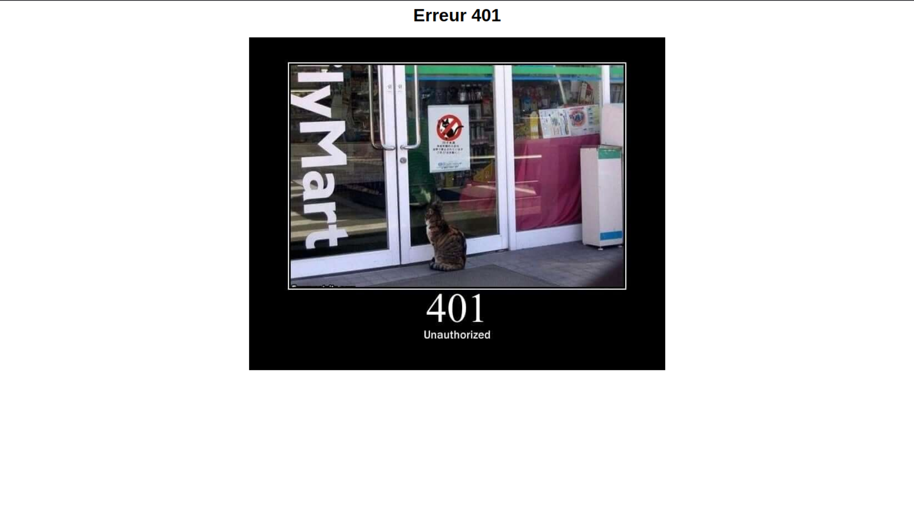

# Caddy_error_with_http.cat

Caddy configuration to display a custom HTML error page with a dynamic image from `https://http.cat` for any HTTP error code (e.g., 404, 401).

## Preview


*Example: Implemented on rv0.fr*

## Prerequisites
- Caddy v2.10.0
- Write permissions for `/etc/caddy/`

## Configuration
Example for the site `[your_domain]`:

```caddy
# Snippet for the custom error page
(error_page) {
    handle_errors {
        header Content-Type "text/html; charset=utf-8"
        header Access-Control-Allow-Origin "*"
        respond <<HTML
        <html lang="en">
        <head>
            <meta charset="UTF-8">
            <meta name="viewport" content="width=device-width, initial-scale=1.0">
            <title>Error - {err.status_code}</title>
        </head>
        <body style="text-align: center; font-family: Arial, sans-serif;">
            <h1>Error {err.status_code}</h1>
            
        </body>
        </html>
        HTML
    }
}

# Site [your_domain]
[your_domain] {
    root * /var/www/html
    file_server
    import error_page
}
```

## Installation
1. Copy the configuration to `/etc/caddy/Caddyfile`.
2. Set permissions: `sudo chown caddy:caddy /etc/caddy/Caddyfile && sudo chmod 644 /etc/caddy/Caddyfile`.
3. Reload Caddy: `sudo systemctl reload caddy` or `caddy reload --config /etc/caddy/Caddyfile`.

## Verification
- Visit `https://[your_domain]/non_existant` to see the 404 error page.

## Notes
- Images are loaded from `https://http.cat/{code}`.
- Apply the `(error_page)` snippet to other sites by adding `import error_page`.